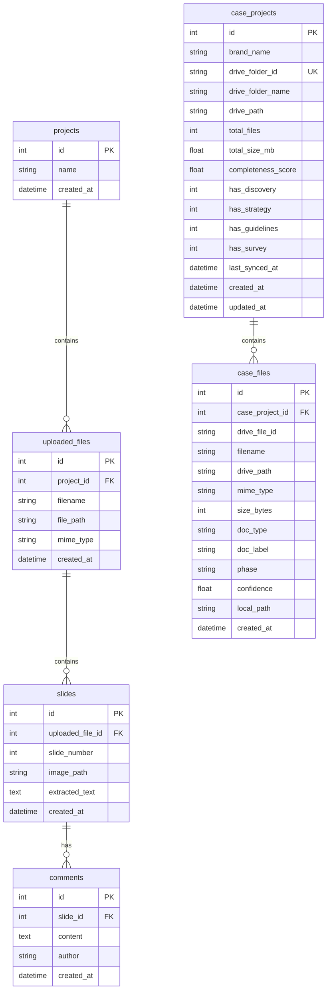

# Customer Discovery Database -- Architecture Specification

**Date:** April 2026
**Module:** Module B -- Customer Discovery Database
**Status:** Phase 1 Specification -- Final

---

## Section 1: System Overview

### 1.1 Module B Purpose

Module B extends the DynaBridge platform with a Customer Discovery Database that organizes, classifies, and makes searchable the firm's library of brand case studies stored on Google Drive. The module enables team members to locate relevant past work by brand, document type, project phase, and completeness status.

### 1.2 Relationship to Module A

Module A provides the core DynaBridge platform: project management, file uploads, slide processing, and commenting. Module B operates as a parallel subsystem that:

- **Shares the same SQLAlchemy `Base`** -- Module B models import `Base` from Module A's `models.py`, ensuring all tables exist in the same database.
- **Does not modify Module A tables** -- Module B defines its own tables (`case_projects`, `case_files`) and does not add columns, constraints, or relationships to any Module A table.
- **Does not depend on Module A data** -- Module B's data originates from Google Drive, not from Module A's upload pipeline. The two datasets are independent.
- **Can be queried alongside Module A** -- Because both modules share the same database, cross-module queries are possible at the application layer for future features (e.g., linking a case study to an active project).

### 1.3 Module B Components

| Component       | File                      | Responsibility                                  |
|-----------------|---------------------------|-------------------------------------------------|
| Data Models     | `module_b/models.py`     | SQLAlchemy ORM definitions for case tables       |
| Taxonomy        | `module_b/taxonomy.py`   | File classification engine (15 types, 6 phases)  |
| Audit Engine    | `module_b/audit.py`      | Completeness scoring and deliverable gap analysis|

---

## Section 2: Data Model

### 2.1 Entity Relationship Diagram



### 2.2 Design Principles

- **Additive schema.** Module B adds tables; it never alters Module A tables.
- **Immutable file records.** Once a `case_files` row is created, its classification fields (`doc_type`, `phase`, `confidence`) are set by the taxonomy classifier and not modified by user action. Re-classification requires a full re-sync.
- **Drive ID as external key.** Both `drive_folder_id` (on `case_projects`) and `drive_file_id` (on `case_files`) serve as stable references back to the Google Drive source.
- **No cross-module foreign keys.** Module B tables do not reference Module A tables via foreign keys. Integration is handled at the application layer.

---

## Section 3: Table Specifications

### 3.1 case_projects

Stores one row per brand case folder in the Google Drive library.

| Column              | Type          | Constraints                    | Description                                                  |
|---------------------|---------------|--------------------------------|--------------------------------------------------------------|
| id                  | Integer       | PRIMARY KEY, AUTO INCREMENT    | Internal identifier.                                         |
| brand_name          | String(255)   | NOT NULL                       | Brand name extracted from the folder name.                   |
| drive_folder_id     | String(100)   | NOT NULL, UNIQUE               | Google Drive folder ID. Serves as the external unique key.   |
| drive_folder_name   | String(500)   | --                             | Original folder name on Google Drive.                        |
| drive_path          | String(1000)  | --                             | Full path from Drive root (e.g., `External/01_AEKE`).       |
| total_files         | Integer       | DEFAULT 0                      | Count of non-folder files in the case.                       |
| total_size_mb       | Float         | DEFAULT 0.0                    | Total size of all files in megabytes.                        |
| completeness_score  | Float         | DEFAULT 0.0                    | Completeness ratio (0.0 to 1.0) from the audit engine.      |
| has_discovery       | Integer       | DEFAULT 0                      | Boolean flag (0/1): Brand Discovery PPT is present.          |
| has_strategy        | Integer       | DEFAULT 0                      | Boolean flag (0/1): Brand Strategy is present.               |
| has_guidelines      | Integer       | DEFAULT 0                      | Boolean flag (0/1): Brand Guidelines are present.            |
| has_survey          | Integer       | DEFAULT 0                      | Boolean flag (0/1): Survey / Research Data is present.       |
| last_synced_at      | DateTime      | --                             | Timestamp of the most recent Google Drive sync.              |
| created_at          | DateTime      | DEFAULT now(UTC)               | Row creation timestamp.                                      |
| updated_at          | DateTime      | DEFAULT now(UTC), ON UPDATE    | Row last-modified timestamp. Auto-updated on write.          |

**Indexes:**

- Primary key on `id`.
- Unique index on `drive_folder_id`.

**Relationships:**

- One-to-many with `case_files` via `case_files.case_project_id`. Cascade delete enabled: deleting a `case_projects` row removes all associated `case_files` rows.

---

### 3.2 case_files

Stores one row per file within a case project, with taxonomy classification metadata.

| Column            | Type          | Constraints                         | Description                                                    |
|-------------------|---------------|-------------------------------------|----------------------------------------------------------------|
| id                | Integer       | PRIMARY KEY, AUTO INCREMENT         | Internal identifier.                                           |
| case_project_id   | Integer       | FOREIGN KEY (case_projects.id), NOT NULL | Reference to the parent case project.                     |
| drive_file_id     | String(100)   | NOT NULL                            | Google Drive file ID.                                          |
| filename          | String(500)   | NOT NULL                            | Original filename from Google Drive.                           |
| drive_path        | String(1000)  | --                                  | Full path within the Drive folder.                             |
| mime_type         | String(200)   | --                                  | MIME type as reported by Google Drive API.                      |
| size_bytes        | Integer       | DEFAULT 0                           | File size in bytes.                                            |
| doc_type          | String(50)    | --                                  | Taxonomy document type (e.g., `discovery`, `strategy`).        |
| doc_label         | String(100)   | --                                  | Human-readable label (e.g., "Brand Discovery").                |
| phase             | String(50)    | --                                  | Project phase (e.g., `discovery`, `strategy`, `design`).       |
| confidence        | Float         | DEFAULT 0.0                         | Classification confidence (0.1, 0.5, 0.7, or 0.9).            |
| local_path        | String(1000)  | --                                  | Local filesystem path if the file has been downloaded.         |
| created_at        | DateTime      | DEFAULT now(UTC)                    | Row creation timestamp.                                        |

**Indexes:**

- Primary key on `id`.
- Foreign key on `case_project_id` referencing `case_projects.id`.

**Relationships:**

- Many-to-one with `case_projects` via `case_project_id`.

---

## Section 4: Integration Points

### 4.1 Shared Database

Module B connects to Module A through the shared SQLAlchemy `Base` object:

```python
from models import Base  # Module A's Base
```

This ensures that `alembic` migrations and `Base.metadata.create_all()` operations produce a single, unified schema containing both Module A and Module B tables. No separate database or connection pool is required.

### 4.2 No Schema Coupling

Module B achieves integration without modifying Module A through the following constraints:

| Constraint                          | Implementation                                                  |
|-------------------------------------|-----------------------------------------------------------------|
| No foreign keys to Module A tables  | `case_projects` and `case_files` only reference each other.     |
| No shared columns                   | Module B does not read or write Module A columns.               |
| No triggers or hooks on Module A    | Module B's sync process is independently triggered.             |
| Independent data lifecycle          | Module B data can be dropped and rebuilt from Drive without affecting Module A. |

### 4.3 Future Cross-Module Queries

While no foreign keys connect the modules, application-layer joins are planned for Phase 2. Example use cases:

- **Link a case to an active project.** A user working on a Module A project for brand X could search Module B for past case work on brand X.
- **Reference slides from case files.** If a case file is uploaded to Module A, its Module B classification metadata (doc_type, phase) could be surfaced in the Module A interface.

These integrations would be implemented as application-layer queries, not database-level constraints, preserving the independence of both modules.

### 4.4 Google Drive Sync Pipeline

The data flow from Google Drive to the database follows this sequence:

```
Google Drive API
    |
    v
[1] List folders in External/ --> create/update case_projects rows
    |
    v
[2] List files per folder --> create case_files rows
    |
    v
[3] classify_file() per file --> populate doc_type, doc_label, phase, confidence
    |
    v
[4] audit_case() per project --> calculate completeness_score, set has_* flags
    |
    v
[5] Update case_projects with audit results
```

---

## Section 5: Phase 2 Planned Extensions

### 5.1 Search Index

A full-text search index will be added to enable queries across filenames, brand names, and document labels. Implementation options under evaluation:

| Option             | Approach                                     | Trade-offs                              |
|--------------------|----------------------------------------------|-----------------------------------------|
| SQLite FTS5        | Virtual table with tokenized filename/label  | Simple, no dependencies; limited ranking |
| PostgreSQL GIN     | Migrate to PostgreSQL with tsvector columns  | Production-grade; requires migration     |
| Meilisearch        | External search service synced from DB       | Best UX; additional infrastructure       |

### 5.2 Vector Embeddings

Planned embedding generation for semantic search over case content:

- **Slide-level embeddings.** Extract text from PPTX slides and generate vector embeddings using an embedding model.
- **Document-level embeddings.** Summarize entire documents and embed the summaries for coarse-grained retrieval.
- **Storage.** Embeddings will be stored in a new `case_embeddings` table with a foreign key to `case_files`.

Candidate embedding models: OpenAI `text-embedding-3-small`, or an open-source alternative (e.g., `bge-base-en-v1.5`).

### 5.3 AI-Generated Tags

Automated tagging using large language models:

- **Industry tags** -- Classify each brand by industry vertical (e.g., consumer electronics, outdoor furniture, fashion).
- **Deliverable quality scores** -- Use LLM analysis to rate the depth and completeness of individual deliverables beyond binary present/absent.
- **Content summaries** -- Generate one-paragraph summaries of key deliverables for quick scanning.

Tags will be stored in a new `case_tags` table with a polymorphic relationship to both `case_projects` and `case_files`.

### 5.4 Additional Schema Extensions

The following tables are planned for Phase 2:

| Table             | Purpose                                                   |
|-------------------|-----------------------------------------------------------|
| case_embeddings   | Vector embeddings for semantic search                     |
| case_tags         | AI-generated and manual tags for cases and files          |
| sync_log          | Audit trail of Drive sync operations (timestamps, counts) |
| export_failures   | Tracking of files that failed to export from Google Drive |

These tables will follow the same design principles as Phase 1: additive schema, no modification of existing tables, and independent data lifecycle.

---

*End of Specification*
